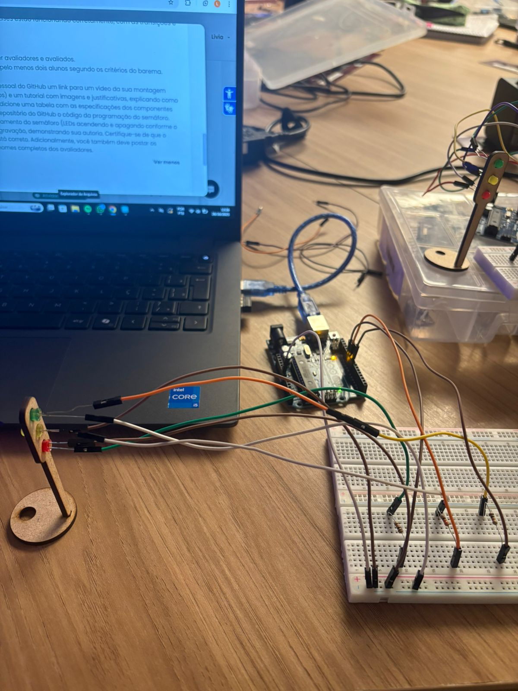
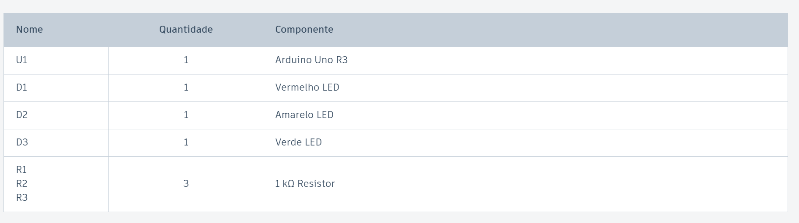

# Ponderada de programação: semáforo (semana 3) - Módulo 4

## Montagem Física do Semáforo

Link do vídeo com a montagem e o semáforo funcionando:

https://drive.google.com/file/d/1viDOJHK7DojQ3vgizGv2N0Dbt7px7rHw/view?usp=sharing

<div align="center"></div>. 

### Etapas da montagem

1. Primeiramente, eu separei os seguintes componentes:

<div align="center"></div>. 

2. Logo após, foi a realizada a montagem, ligando:

- Os terminais negativos dos Leds vermelho, amarelo e verde na linha terra da protoboard, diretamente conectada ao GND do Arduino.

- Os terminai positivos dos Leds vermelho, amarelo e verde respectivamente ligados nos seguintes pinos do Arduino: 11, 10 e 9. Essa ligação foi intermediada por resistores.

## Código 

Para o funcionamento do semáforo, produzi o seguinte código:

``` cpp

// Definições dos Pinos dos LEDs 
const int LED_VERMELHO = 11;
const int LED_AMARELO = 10;
const int LED_VERDE = 9;

// Definições dos Tempos em milissegundos (ms)
const unsigned long TEMPO_VERDE = 6000;  // 6 segundos
const unsigned long TEMPO_AMARELO = 2000; // 2 segundos
const unsigned long TEMPO_VERMELHO = 4000; // 4 segundos

// Definição dos estados do semáforo
enum EstadoSemaforo {
  VERDE_ACESO,
  AMARELO_ACESO,
  VERMELHO_ACESO
};

EstadoSemaforo estadoAtual = VERMELHO_ACESO; // inicia no Vermelho por segurança
unsigned long tempoAnterior = 0;             // variável para armazenar o último momento da troca de estado

void setup() {
  pinMode(LED_VERMELHO, OUTPUT);
  pinMode(LED_AMARELO, OUTPUT);
  pinMode(LED_VERDE, OUTPUT);

  // liga o led vermelho e os outros 2 permanecem desligados
  digitalWrite(LED_VERMELHO, HIGH);
  digitalWrite(LED_AMARELO, LOW);
  digitalWrite(LED_VERDE, LOW);
  
  tempoAnterior = millis(); // começa a contar o tempo
}

void loop() {
  // obtém o tempo atual
  unsigned long tempoAtual = millis();
  
  // calcula o tempo decorrido desde a última mudança
  unsigned long tempoDecorrido = tempoAtual - tempoAnterior;

  switch (estadoAtual) {
    
    case VERMELHO_ACESO:
      // verifica se o tempo do VERMELHO acabou
      if (tempoDecorrido >= TEMPO_VERMELHO) {
        // altera o estado para VERDE
        estadoAtual = VERDE_ACESO;
        
        // liga o LED VERDE e desliga os outros 
        digitalWrite(LED_VERMELHO, LOW);
        digitalWrite(LED_AMARELO, LOW);
        digitalWrite(LED_VERDE, HIGH);
        
        // reinicia o contador de tempo para o novo estado
        tempoAnterior = tempoAtual;
      }
      break;

    case VERDE_ACESO:
      // verifica se o tempo de VERDE acabou
      if (tempoDecorrido >= TEMPO_VERDE) {
        // altera o estado para AMARELO
        estadoAtual = AMARELO_ACESO;
        
        // liga o LED AMARELO e desliga os outros
        digitalWrite(LED_VERMELHO, LOW);
        digitalWrite(LED_AMARELO, HIGH);
        digitalWrite(LED_VERDE, LOW);
        
        // reinicia o contador de tempo para o novo estado
        tempoAnterior = tempoAtual;
      }
      break;

    case AMARELO_ACESO:
      // verifica se o tempo de AMARELO acabou
      if (tempoDecorrido >= TEMPO_AMARELO) {
        // altera o estado para VERMELHO
        estadoAtual = VERMELHO_ACESO;
        
        // Liga o LED VERMELHO e desliga os outros
        digitalWrite(LED_VERMELHO, HIGH);
        digitalWrite(LED_AMARELO, LOW);
        digitalWrite(LED_VERDE, LOW);
        
        // reinicia o contador de tempo para o novo estado
        tempoAnterior = tempoAtual;
      }
      break;
  }
}

```

## Avaliação entre Pares

**Avaliador:** Emanuelly Cantarelli
| **Critério**                                                                                                        | **Contempla (Pontos)** | **Contempla Parcialmente (Pontos)** | **Não Contempla (Pontos)** | **Observações do Avaliador** |
| ------------------------------------------------------------------------------------------------------------------- | ---------------------- | ----------------------------------- | -------------------------- | ---------------------------- |
| Montagem física com cores corretas, boa disposição dos fios e uso adequado de resistores                            | Até 3                  | Até 1,5                             | 0                          |     O semáforo construído contempla de forma adequada os resistores e fios de maneira lógica e de fácil visualização.                         |
| Temporização adequada conforme tempos medidos com auxílio de algum instrumento externo                              | Até 3                  | Até 1,5                             | 0                          |   Utilizando o cronômetro do celular, confirmei que o tempo em que os leds estão acesos condizem com a instrução da atividade.                           |
| Código implementa corretamente as fases do semáforo e estrutura do código (variáveis representativas e comentários) | Até 3                  | Até 1,5                             | 0                          |        O código desenvolvido contempla uma estruturação muito bem feita, sendo a leitura muito fluida e os comentários pertinentes.                      |
| Ir além: Implementou um componente extra, fez com `millis()` ao invés do `delay()` e/ou usou ponteiros no código    | Até 1                  | Até 0,5                             | 0                          |     A Lívia utilizou o `millis()` ao invés de `delay()`, e consequentemente contemplou corretamente o critério definido.                         |


<br> <br>

**Avaliador:** Nicolli Venino
| **Critério**                                                                                                        | **Contempla (Pontos)** | **Contempla Parcialmente (Pontos)** | **Não Contempla (Pontos)** | **Observações do Avaliador** |
| ------------------------------------------------------------------------------------------------------------------- | ---------------------- | ----------------------------------- | -------------------------- | ---------------------------- |
| Montagem física com cores corretas, boa disposição dos fios e uso adequado de resistores                            | Até 3                  | Até 1,5                             | 0                          |    Apesar das cores dos fios não serem muito bem definidas para o positivo e o negativo, entende-se que o semáforo construído contempla uma montagem adequada, pois é possível entender as ligações feitas mesmo com essa observação.                          |
| Temporização adequada conforme tempos medidos com auxílio de algum instrumento externo                              | Até 3                  | Até 1,5                             | 0                          |     No início, a temporização dos leds vermelho e verde estavam trocadas, mas após eu dizer, foi muito fácil de consertar.           |
| Código implementa corretamente as fases do semáforo e estrutura do código (variáveis representativas e comentários) | Até 3                  | Até 1,5                             | 0                          |    O código está muito bem comentado, explicando corretamente todas as escolhas feitas durante a sua construção.                          |
| Ir além: Implementou um componente extra, fez com `millis()` ao invés do `delay()` e/ou usou ponteiros no código    | Até 1                  | Até 0,5                             | 0                          |     O uso de `millis()` ao invés de `delay()` atendeu o critério exigido.                         |
